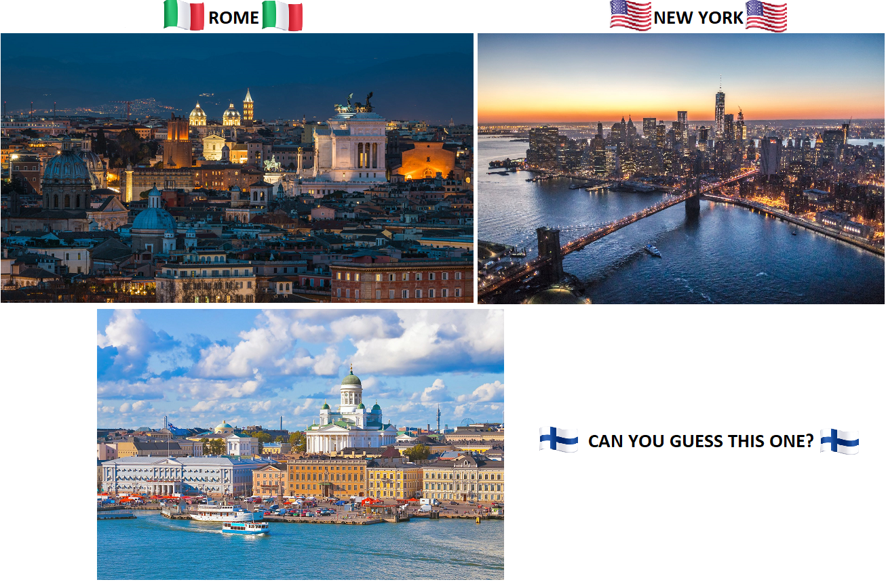

<h1 align="center">👋Ciao, thanks for stopping by!</h1>

## 😎About Me

I am Giovan Battista (but you can call me GB). I am originally from Italy but I'm currently located in New York City. I recently received my PhD in Math from the City University of New York (if you are curious about the content of my thesis, you can get your own digital copy [here](https://academicworks.cuny.edu/gc_etds/4775/)). Halfway through my graduate program I picked up an interest in Data Science. Over the following years, through constant practice, many readings and original projects, this interest turned into a professional passion. Now that I've graduated, I'm excited to officially start my career as a Data Analyst and see where this journey takes me. 

- 👨🏻‍💻 **What I've Done:** [🏀 NBAvsEL](https://github.com/gb-pignatti/NBAvsEL) | [🎬 predicting_movies_revenues](https://github.com/gb-pignatti/predicting_movies_revenues) | [🤖 ML_from_scratch](https://github.com/gb-pignatti/ML_from_scratch)
- ✨ **Hobbies:** 🎵 Going to as many concerts as possible | 🥇 Watching sports and rooting for Italy at the Olympics
- 🌈 **Fun Fact:** 👧 My sister is exactly 20 years younger than me

## ⚡ My Skill Set

  

 

    

## 🏙️ Cities I've Lived In

    
## 🔗 Connect with Me

